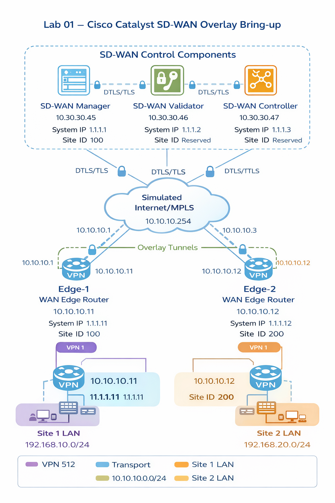
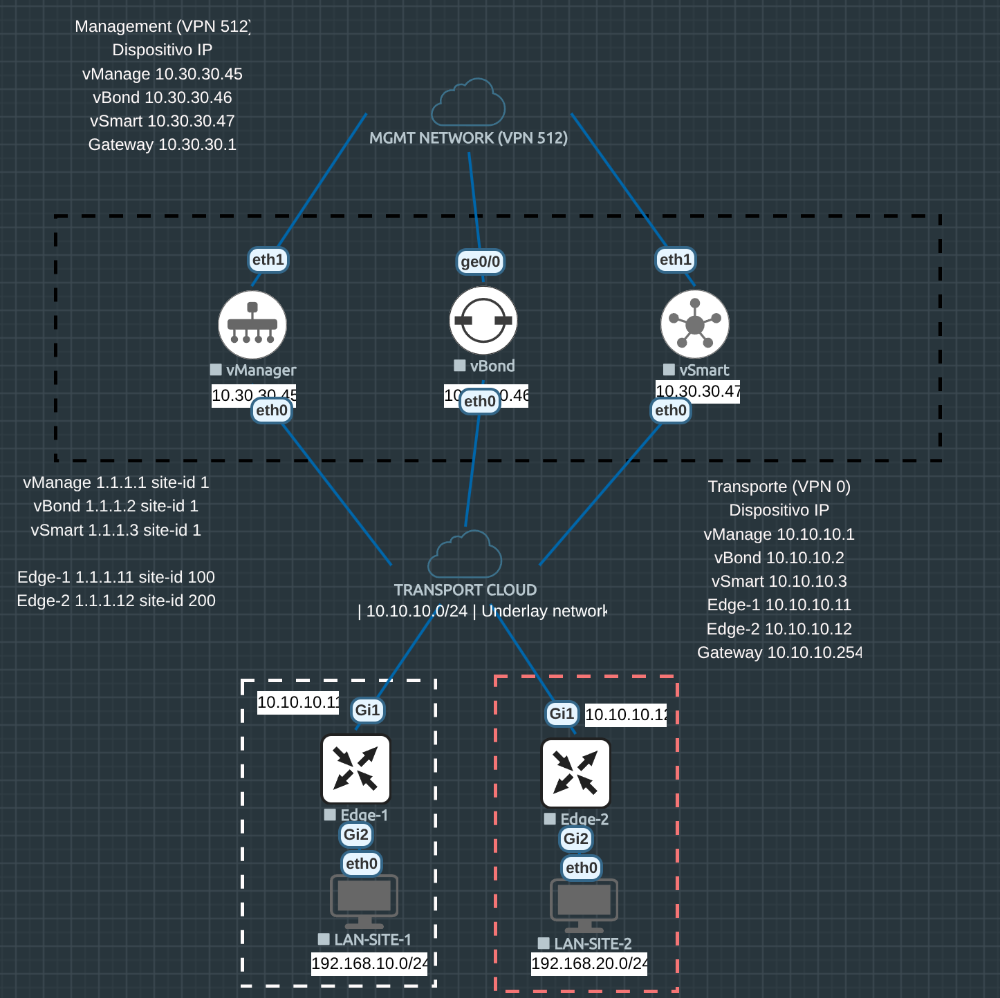

# Lab 01 – Cisco Catalyst SD-WAN Overlay Bring-up

## Información general

| Campo | Valor |
|------|------|
| Lab | 01 |
| Tecnología | Cisco Catalyst SD-WAN |
| Nivel | Intermedio |
| Entorno | EVE-NG |
| Fecha | YYYY-MM-DD |

---

# 1. Objetivo del laboratorio

Construir un entorno funcional de Cisco Catalyst SD-WAN y validar el proceso completo de incorporación de dispositivos WAN Edge al fabric SD-WAN.

El laboratorio busca demostrar:

- formación del plano de control
- onboarding de routers WAN Edge
- establecimiento de túneles de overlay
- conectividad entre sedes a través del fabric SD-WAN

---

# 2. Contexto técnico

Cisco Catalyst SD-WAN se basa en una arquitectura centralizada que separa:

- plano de gestión
- plano de control
- plano de datos

Los componentes principales del sistema son:

| Componente | Función |
|------------|---------|
| SD-WAN Manager | Gestión centralizada |
| SD-WAN Validator | Orquestación y autenticación |
| SD-WAN Controller | Plano de control |
| WAN Edge | Routers de sucursal |

Los WAN Edge establecen túneles seguros sobre una red de transporte (underlay) para formar el **overlay SD-WAN**.

---

# 3. Arquitectura del laboratorio

## Topología del laboratorio

La siguiente topología representa el entorno desplegado en EVE-NG para validar el funcionamiento básico del fabric Cisco Catalyst SD-WAN.

## Topología del laboratorio en EVE-NG

El laboratorio incluye los componentes de control (vManage, vBond y vSmart), dos routers WAN Edge y dos redes LAN simulando dos sucursales conectadas a través del overlay SD-WAN.

## Componentes

| Nodo | Rol |
|-----|-----|
| Manager | Gestión |
| Validator | Orquestación |
| Controller | Plano de control |
| Edge-1 | Sucursal 1 |
| Edge-2 | Sucursal 2 |

## Redes

| Red | Uso |
|----|----|
| VPN 512 | Gestión |
| VPN 0 | Transporte |
| VPN 1 | LAN Site 1 |
| VPN 1 | LAN Site 2 |

---

# 4. Topology and Addressing Plan

## 4.1 System IP y Site ID

| Nodo | System-IP | Site-ID | Rol |
|-----|-----------|--------|------|
| vManage | 1.1.1.1 | 1 | Management |
| vBond | 1.1.1.2 | 1 | Orchestrator |
| vSmart | 1.1.1.3 | 1 | Control Plane |
| Edge-1 | 1.1.1.11 | 100 | Branch Site 1 |
| Edge-2 | 1.1.1.12 | 200 | Branch Site 2 |

---

## 4.2 Management Network (VPN 512)

| Dispositivo | Interfaz | Dirección IP | Gateway |
|-------------|-----------|-------------|---------|
| vManage | eth1 | 10.30.30.45 | 10.30.30.1 |
| vBond | eth1 | 10.30.30.46 | 10.30.30.1 |
| vSmart | eth1 | 10.30.30.47 | 10.30.30.1 |

Red de gestión:

10.30.30.0/24

Uso: red de administración de los control components.

---

## 4.3 Transport Network (VPN 0)

| Dispositivo | Interfaz | Dirección IP |
|-------------|-----------|-------------|
| vManage | eth0 | 10.10.10.1 |
| vBond | eth0 | 10.10.10.2 |
| vSmart | eth0 | 10.10.10.3 |
| Edge-1 | Gi1 | 10.10.10.11 |
| Edge-2 | Gi1 | 10.10.10.12 |

Gateway del transporte:

10.10.10.254

Red de transporte:

10.10.10.0/24

Uso: underlay transport utilizado para formar el overlay SD-WAN.

---

## 4.4 Service VPN (LAN Sites)

### Site 1

| Dispositivo | Interfaz | Red |
|-------------|-----------|------|
| Edge-1 | Gi2 | 192.168.10.0/24 |

---

### Site 2

| Dispositivo | Interfaz | Red |
|-------------|-----------|------|
| Edge-2 | Gi2 | 192.168.20.0/24 |

---

## 4.5 VPN Segmentación

| VPN | Uso |
|----|----|
| VPN 512 | Management plane |
| VPN 0 | Transport underlay |
| VPN 1 | Service VPN (LAN usuarios) |

# 5. Hipótesis

Si:

- existe conectividad IP en el underlay
- los control components están correctamente configurados
- los WAN Edge son autorizados

entonces:

los routers WAN Edge se incorporarán correctamente al fabric SD-WAN y se establecerá conectividad entre las redes LAN de cada sitio.

---

# 6. Procedimiento

## 6.1 Despliegue del entorno en EVE-NG

Se despliegan los siguientes nodos:

- Manager
- Validator
- Controller
- Edge-1
- Edge-2

---

## 6.2 Configuración inicial de control components

Configuración de:

- system-ip
- site-id
- org-name
- VPN 512
- VPN 0

---

## 6.3 Verificación de reachability

Validar conectividad IP entre todos los control components.

---

## 6.4 Incorporación de WAN Edge

Los dispositivos WAN Edge se registran en el sistema y son autorizados.

---

## 6.5 Aplicación de configuración

Se aplica configuración básica de servicio para permitir conectividad entre LANs.

---

# 7. Validaciones técnicas

Las validaciones incluyen:

- estado de control connections
- estado de túneles overlay
- tabla de rutas del fabric
- pruebas de conectividad entre sedes

---

# 8. Resultados obtenidos

El sistema SD-WAN se levantó correctamente y se verificó conectividad entre:

- 192.168.10.0/24
- 192.168.20.0/24

a través del overlay SD-WAN.

---

# 9. Problemas encontrados

(Se documentarán aquí los errores encontrados durante el laboratorio.)

---

# 10. Lecciones aprendidas

Este laboratorio permitió comprender:

- el proceso de onboarding de routers SD-WAN
- la diferencia entre underlay y overlay
- el rol de cada componente del sistema

---

# 11. Mejores prácticas

- Validar siempre conectividad underlay antes de iniciar onboarding.
- Mantener consistencia en `org-name`, `site-id` y `system-ip`.
- Verificar reachability entre control components antes de incorporar edges.

---

# 12. Próximos experimentos

**Lab 02**

Templates y automatización de configuración en Cisco Catalyst SD-WAN.
